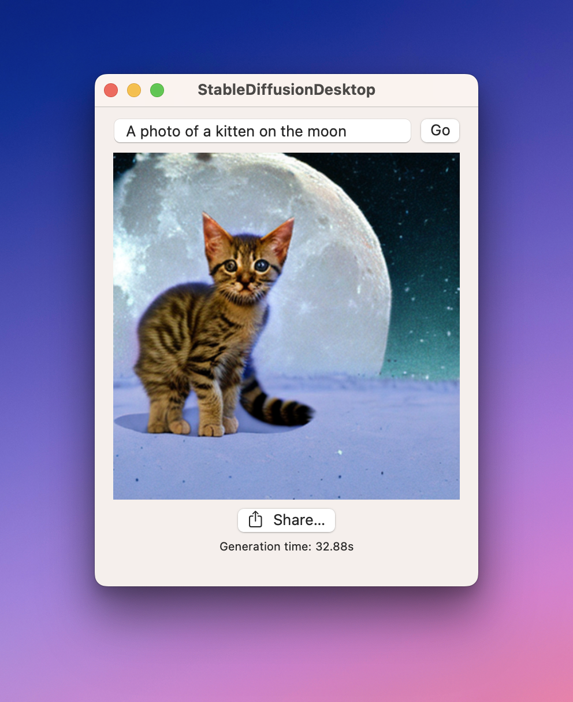

# Stable Diffusion on Apple Silicon

This repo contains a simple app for running Stable Diffusion natively on macOS.



# Getting started

The app expects to be able to download models at startup from http://localhost:8080/models.zip. This means you need to acquire the models, zip them, then host them locally. Here's how...

## Acquiring the models

Either follow the instructions [here](https://github.com/apple/ml-stable-diffusion#-using-ready-made-core-ml-models-from-hugging-face-hub) to use pre-built models from Hugging Face Hub, or the instructions [here](https://github.com/apple/ml-stable-diffusion#-using-ready-made-core-ml-models-from-hugging-face-hub) to build them yourself.

If building the models yourself, make sure to use the (slightly mis-named) `--bundle-resources-for-swift-cli` option, to output models in a format suitable for consumption by Swift. (The default is to output models suitable for consumption by Python).

Either way, you should end up with a folder with these contents:

- TextEncoder.mlmodelc
- Unet.mlmodelc
- VAEDecoder.mlmodelc
- merges.txt
- vocab.json

To build the .zip model archive, `cd` to that directory and run:

```command
rm -f models.zip && zip -r models.zip *
```

Now serve the models on localhost:8080 by running this command in the same directory:

```command
python3 -m http.server 8080
```
